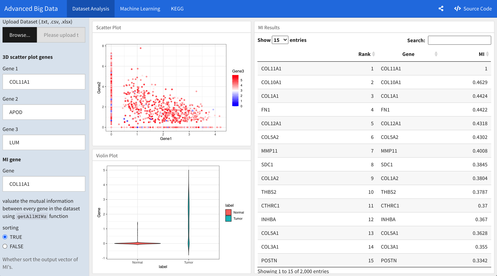
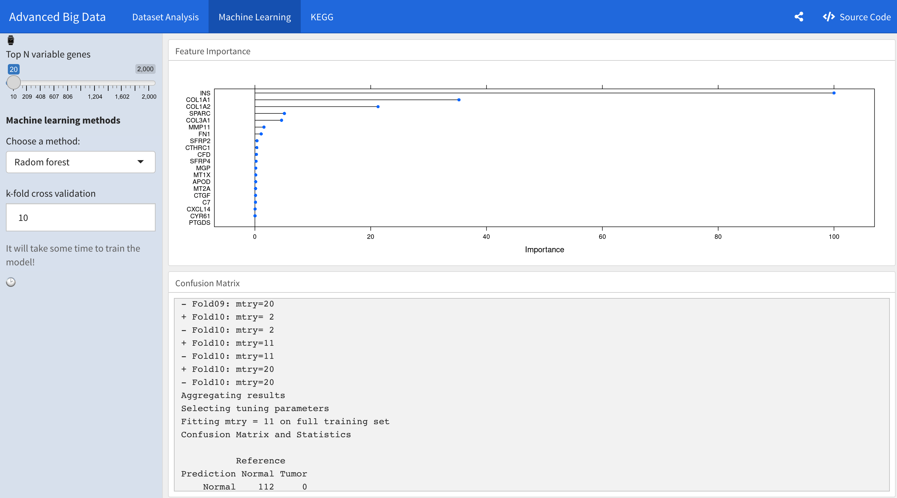
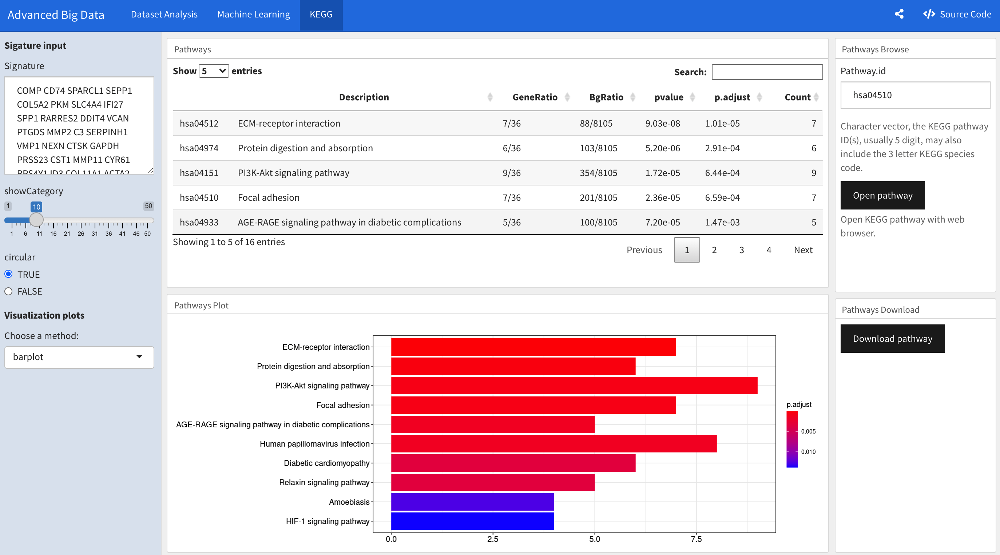

# 202105-16-scRNA-counterfactual

Wei Zhang, wz2363 | Lingyi Cai, lc3352

From studies from the Centers for Disease Control and Prevention (CDC), Each year in the United States, more than 1.7 million people are diagnosed with cancer, and almost 600,000 die from it, making it the nation’s second leading cause of death. The cost of cancer care continues to rise and is expected to reach almost $174 billion by 2020, it's also very shocking that 1 in 3 people will have cancer in their lifetime. As we know cancer is complicated to cure, more than one thousand genes may involve in cancer development, and there are thousands of subtypes of cancer.  So,  we will be trying to make a real and tangible difference in the fight against cancer. In addition, we propose to implement a web server for this framework, so that the analysis can be performed without writing any code. This user-friendly tool can be convenient for biologists who are not familiar with programming languages.
From studies from the Centers for Disease Control and Prevention (CDC), Each year in the United States, more than 1.7 million people are diagnosed with cancer, and almost 600,000 die from it, making it the nation’s second leading cause of death. The cost of cancer care continues to rise and is expected to reach almost $174 billion by 2020, it's also very shocking that 1 in 3 people will have cancer in their lifetime. As we know cancer is complicated to cure, more than one thousand genes may involve in cancer development, and there are thousands of subtypes of cancer. Meanwhile, the deep learning technology has been revolutionizing over the past decade in many fields such as computer vision, natural language processing and many others. However, there are two challenges remaining. First, the black-box property of deep neural networks has made models hard to explain and analyze. Tackling this challenge becomes even harder as the architectures of neural networks are deriving intricately nowadays. Second, although deep neural networks have achieves extraordinary performance in tasks such as classification, such calibrated designs might only learn the association instead of the causation. Those two remaining challenges hinder the application of deep learning technologies from being used in a wider range such as financial industry and healthcare system. In addition, we propose to implement a web server for this framework, so that the analysis can be performed without writing any code. This user-friendly tool can be convenient for biologists who are not familiar with programming languages.

We mainly focus on proposing marker genes by using counterfactual framework. In particular, we reproduce the counterfactual imputation algorithm from (Yongjin Park, et al.). Then, we focus on improving the algorithm by learning a better representation using deep learning. We primarily leverage the auto encoder paradigm for such a purpose like variational autoencoder and normalizing flows. In addition, we also apply a supervisory signal to help the unsupervised learning task. The empirical evaluation shows it can improve the final results. 
We experiment with a public data set using our proposed method. We evaluate the performance using KEGG tools. For visualization, we use R package along with the Shiny library to host our interactive website on shinyapp.io. 

